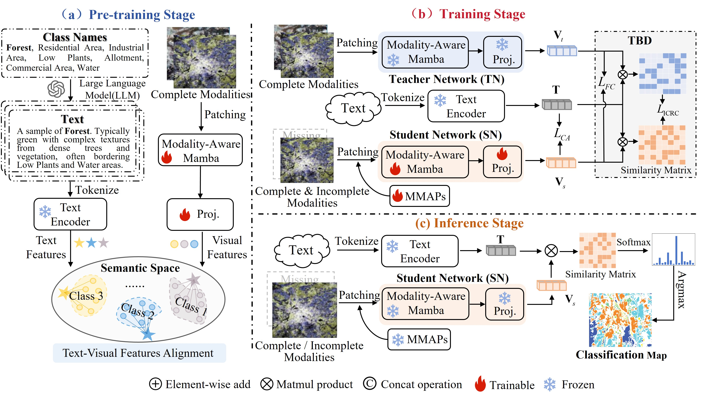

# DPMamba
DPMamba: Distillation Prompt Mamba for Multimodal Remote Sensing Image Classification with Missing Modalities

*Yueguang Yang, Jiahui Qu, Ling Huang, Wenqian Dong*


    

## Environment Setup

Please refer to the [VMamba installation instructions](https://github.com/MzeroMiko/VMamba) for the environment setup.


## Quick Start

### Data Preparation
1. The data can be downloaded from [Google Drive](https://drive.google.com/drive/folders/1nbOzUDTT0GXN8VDpw7ldWTt7WG-NRYG_?usp=sharing).

2. Organize dataset structure:
```txt
datasets/
├── Houston/
│   ├── HSI.mat
│   ├── LiDAR.mat         
│   ├── All_label.mat
├── Trento/
│   ├── HSI.mat
│   ├── LiDAR.mat         
│   ├── All_label.mat
├── Augsburg/
│   ├── HSI.mat
│   ├── LiDAR.mat     
│   ├── SAR.mat       
│   ├── All_label.mat
└──
```
   

### Pre-training Stage
Download pre-trained text encoder from [Google Drive](https://drive.google.com/file/d/1lGomu2aL8PWBiPC-kq2NnCJjDbqAkYWX/view?usp=sharing)
and place it in the root directory.

```shell
python main_RS.py --cfg configs/<dataset name>.yaml  --is_Pretrain True 
```

### Training Stage
```shell
python main_RS.py --cfg configs/<dataset name>.yaml --is_Pretrain False --MODEL_PATH <pre-trained model path> 
```


## Citation
If you find our work helpful for your research, please consider citing our paper as follows:
``` BibTex
@inproceedings{yang2025DPMamba,
  title     = {DPMamba: Distillation Prompt Mamba for Multimodal Remote Sensing Image Classification with Missing Modalities},
  author    = {Yang, Yueguang and Qu, Jiahui and Huang, Ling and Dong, Wenqian},
  booktitle = {Proceedings of the Thirty-Fourth International Joint Conference on
               Artificial Intelligence, {IJCAI-25}},
  pages     = {2224--2232},
  year      = {2025},
  doi       = {10.24963/ijcai.2025/248},
  url       = {https://doi.org/10.24963/ijcai.2025/248},
}
```

## Acknowledgement

We gratefully acknowledge the following open-source projects that inspired or contributed to our implementation:

- [VMamba](https://github.com/MzeroMiko/VMamba)
- [Swin Transformer](https://github.com/microsoft/Swin-Transformer)


